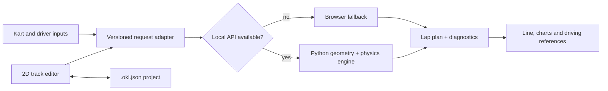

# OpenKartLine


> An open-source, local-first 2D kart racing-line and lap-planning application.

[](https://github.com/Navesz/openkartline/actions/workflows/ci.yml)
[](https://github.com/Navesz/openkartline/actions/workflows/codeql.yml)
[](https://github.com/Navesz/openkartline/actions/workflows/docs.yml)
[](LICENSE)
[](docs/ROADMAP.md)

[Leia em português](README.pt-BR.md) · [Try the web demo](https://navesz.github.io/openkartline/) · [Roadmap](docs/ROADMAP.md) · [Contribute](CONTRIBUTING.md)


OpenKartLine turns a metric track shape and kart characteristics into an explainable lap estimate: a baseline racing line, speed profile, estimated lap time, and braking, apex, and acceleration references. The runnable alpha works in a browser without an account; when the local Python engine is available, the same interface automatically uses its stricter geometry and point-mass simulation.

This is an engineering and learning tool, not a safety system. Its output is an unvalidated planning estimate and must be checked progressively in a controlled environment.

## What works today

- Edit a closed 2D centerline, add or drag points, pan, zoom, fit, and undo/redo.
- Import a satellite/photo background and calibrate its scale with two clicks, or import a GPX/CSV GPS lap as a centerline.
- Set track width and direction and start from synthetic circuits or OpenStreetMap examples.
- Describe kart power, mass, top speed, lateral grip, and braking capability.
- Calculate a deterministic minimum-bending path and cyclic point-mass speed profile.
- Inspect a color-coded line, synchronized distance charts, metrics, and driving references.
- Save and reopen portable `.okl.json` projects (schema 0.2.0, with optional background image).
- Run entirely in the browser with a TypeScript port of the engine (parity-tested against Python fixtures) or connect to the local FastAPI engine.
- Receive explicit assumptions, geometry errors, solver state, model version, and diagnostics.

The current solver is a constrained baseline, **not** a globally optimal minimum-time trajectory. Independent left/right boundaries, telemetry calibration, joint path/control optimization, and native installers are roadmap work.

## How it compares

Lap-time simulation is a well-served field, and for most of it there are better tools than this one. The honest positioning:

| Project | Strength | Where it beats OpenKartLine |
|---|---|---|
| [TUMFTM/global_racetrajectory_optimization](https://github.com/TUMFTM/global_racetrajectory_optimization) | Minimum-curvature and minimum-time raceline optimization, used in real autonomous racing | The optimization itself, by a wide margin. Genuine minimum-time formulations, richer track handling, published research behind it |
| [fastest-lap](https://github.com/juanmanzanero/fastest-lap) | Vehicle dynamics simulator with optimal-lap-time solvers | Vehicle model fidelity: suspension, aerodynamics, and load transfer, none of which a point-mass model has |
| [OpenLAP](https://github.com/mc12027/OpenLAP-Lap-Time-Simulator) | Well-documented MATLAB lap-time simulator with detailed vehicle modelling | Depth of the vehicle model and its teaching material, if you already have MATLAB |

Those three target full-size race cars and expect you to bring a Python, C++, or MATLAB setup before you see a result.

OpenKartLine differs in scope and in delivery. The scope is karts and a point-mass model, which is a deliberately smaller problem. The delivery is an interactive metric track editor plus a solver that runs with no install and no account, where the browser numbers match the Python numbers because the TypeScript port is parity-tested against committed Python fixtures to roundoff. Import a satellite image or a GPX lap, drag the points, and read braking references off the line.

If you want the best possible racing line for a race car, use the first one on that list. If you want to reason about a kart lap in your browser and read the code that produced the number, this is aimed at you.

## Quick start

Requirements: Node.js 24, pnpm 11 through Corepack, Python 3.11–3.13, and [uv](https://docs.astral.sh/uv/).

```bash
git clone https://github.com/Navesz/openkartline.git
cd openkartline
corepack enable
pnpm install --frozen-lockfile
uv sync --locked --all-extras --dev
```

Run the API in one terminal:

```bash
uv run openkartline-api
```

Run the web application in another:

```bash
pnpm dev
```

Open `http://localhost:5173`. The header says **MVP engine connected** when the Python API is in use and **Local mode** when the deterministic browser fallback is active. The interface is in English by default and switches to Portuguese from the EN/PT control in the header. API documentation is available at `http://127.0.0.1:8000/docs`.

Run the complete local verification:

```bash
pnpm check
pnpm exec playwright install chromium
pnpm test:e2e
uv run ruff check .
uv run ruff format --check .
uv run mypy engine services
uv run pytest
```

See [Development](docs/DEVELOPMENT.md) for platform notes and troubleshooting.

## How it fits together



| Layer | Current implementation | Responsibility |
|---|---|---|
| Web | React 19, TypeScript, Vite, SVG | Metric editor, local files, visualization, browser fallback |
| API | FastAPI, Pydantic | Versioned HTTP boundary, validation, OpenAPI |
| Engine | Python, NumPy | Geometry preparation, minimum-bending baseline, speed profile, markers |
| Quality | pytest, Vitest, Playwright, Ruff, mypy, ESLint, Prettier | Deterministic regression and cross-platform gates |
| Operations | GitHub Actions, CodeQL, Dependabot, Pages | CI, security checks, dependency updates, static demo |

The scientific core has no React or HTTP dependency. The local API is deliberately synchronous and bounded for this alpha; a separate worker is reserved for future long-running nonlinear solvers. Read [Architecture](docs/ARCHITECTURE.md), [Physics](docs/PHYSICS.md), the evidence standards in [Validation](docs/VALIDATION.md), and the measured [v0.1.0 validation report](docs/VALIDATION_REPORT.md).

## Repository map

```text
apps/web/          Interactive editor, viewer, and browser solver
services/api/      Thin local FastAPI service
engine/            Framework-independent geometry and physics
packages/schemas/  Shared format documentation and schemas
tests/python/      Engine/API tests and deterministic fixtures
docs/              Architecture, product, safety, roadmap, and operations
examples/          Synthetic or explicitly redistributable examples only
```

## Contributing and project health

Contributions in English or Brazilian Portuguese are welcome. Start with [CONTRIBUTING.md](CONTRIBUTING.md), choose an issue, and use the pull-request template. The project includes governance, a code of conduct, security and privacy policies, issue forms, locked dependencies, release procedures, and a public roadmap.

Funding is intentionally transparent: no donation destination is published until the repository owner activates and verifies one. See [Funding](docs/FUNDING.md).

## Safety and privacy

Track accuracy, tires, surface, temperature, kart condition, and driver behavior can move every suggested reference. Keep a conservative margin, obey the circuit, and never treat a predicted brake point as an instruction to exceed your ability. Project files remain local unless you choose to share them; do not commit private telemetry or imagery without redistribution rights. Read [Safety](docs/SAFETY.md) and [Privacy](docs/PRIVACY.md).

## License and citation

Code is licensed under [Apache-2.0](LICENSE). Third-party and data provenance rules are in [THIRD_PARTY.md](THIRD_PARTY.md). If the project contributes to research, cite the exact release or commit using [CITATION.cff](CITATION.cff).
