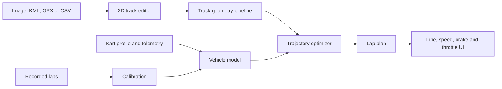

# OpenKartLine

> Open-source 2D kart racing-line and lap-time optimization.

[Leia em Português](README.pt-BR.md)

OpenKartLine aims to turn track geometry and kart characteristics into an explainable minimum-time lap plan: racing line, target speed, braking zones, turn-in, apex, and throttle application.

The project is currently in **planning / pre-alpha**. The repository is public early so drivers, engineers, students, and developers can shape the model before implementation choices become expensive.

## Why this project

Most tools are either engineering simulators that are difficult for drivers to use, or telemetry analyzers that require an existing reference lap. OpenKartLine is intended to bridge that gap with a visual, local-first workflow:

1. Import or draw a 2D circuit.
2. Define the usable track boundaries and direction.
3. Describe or calibrate a kart.
4. Compute a racing line and speed profile.
5. Present the result as practical, explainable driving guidance.
6. Compare the prediction with real telemetry and improve the model.

## Planned output

- Racing line inside explicit track boundaries.
- Target speed and estimated lap time.
- Brake, coast, partial-throttle, and full-throttle zones.
- Turn-in, apex, and exit markers.
- Synchronized 2D animation and distance-based charts.
- Comparison between simulated and recorded laps.
- Confidence and calibration information instead of false precision.

## Architecture at a glance



The initial stack is React/TypeScript for the editor, FastAPI for a small local API, and Python scientific libraries for geometry and optimization. The solver runs outside the API process so a long optimization cannot freeze the application. See [Architecture](docs/ARCHITECTURE.md) and [Stack decisions](docs/STACK.md).

## Delivery strategy

OpenKartLine will grow through models that can be independently tested:

- **Geometry baseline:** shortest-path and minimum-curvature lines.
- **Physics MVP:** point-mass kart, friction envelope, and forward/backward speed profile.
- **Minimum-time model:** jointly optimize path and controls with CasADi/IPOPT.
- **Calibrated model:** estimate unknown kart parameters from telemetry.
- **Advanced model:** optional transient kart dynamics and higher-performance solver backends.

The detailed phases and acceptance criteria are in the [Roadmap](docs/ROADMAP.md).

## Repository layout

```text
apps/web/          React track editor and visualization
services/api/      Local FastAPI boundary and job orchestration
engine/            Physics, geometry, calibration, and optimization
packages/schemas/  Versioned data contracts shared across components
docs/              Product, architecture, physics, formats, and ADRs
examples/          Redistributable example tracks and kart profiles
tests/fixtures/    Deterministic validation fixtures
```

Directories are placeholders until their corresponding roadmap milestone starts. There is no runnable simulator yet.

## Project principles

- Physics first; machine learning may calibrate a model but must not hide it.
- Local-first, no account required, and no mandatory cloud service.
- SI units inside the engine; display units are a UI concern.
- Every result includes assumptions, solver status, and model version.
- Simple models must be validated before more complex models are added.
- The application provides planning estimates, not a safety guarantee.

## Contributing

Start with [CONTRIBUTING.md](CONTRIBUTING.md), the [Roadmap](docs/ROADMAP.md), and an issue. Architectural changes use short ADRs under `docs/adr/`. Contributions in English or Brazilian Portuguese are welcome; canonical technical documents are maintained in English so the project can serve an international community.

## Safety

Simulation results depend on track accuracy, tires, surface, weather, kart condition, and driver inputs. Treat all recommendations as estimates, validate progressively in a controlled environment, obey the circuit's rules, and never use the tool as a reason to exceed your ability or available safety margin.

## License

OpenKartLine is licensed under the [Apache License 2.0](LICENSE). Third-party projects are not automatically part of OpenKartLine; proposed integrations and their license boundaries are tracked in [THIRD_PARTY.md](THIRD_PARTY.md).
