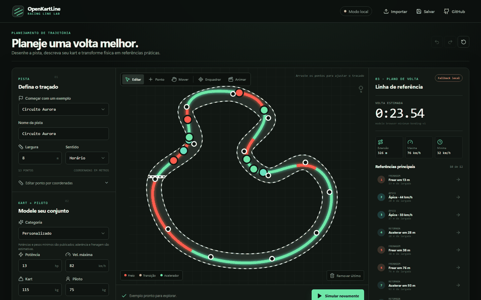
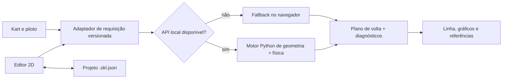

# OpenKartLine


> Uma aplicação 2D, open source e local-first para planejar linha de corrida e volta de kart.

[](https://github.com/Navesz/openkartline/actions/workflows/ci.yml)
[](https://github.com/Navesz/openkartline/actions/workflows/codeql.yml)
[](https://github.com/Navesz/openkartline/actions/workflows/docs.yml)
[](LICENSE)
[](docs/ROADMAP.md)

[Read in English](README.md) · [Testar a demo web](https://navesz.github.io/openkartline/) · [Roadmap](docs/ROADMAP.md) · [Contribuir](CONTRIBUTING.md)



O OpenKartLine transforma o formato métrico de uma pista e as características do kart em uma estimativa explicável de volta: linha-base, perfil de velocidade, tempo estimado e referências de frenagem, ápice e retomada. O alpha já funciona no navegador sem conta; quando o motor Python local está disponível, a mesma interface passa automaticamente a usar sua geometria e simulação point-mass mais rigorosas.

Este é um projeto de engenharia e aprendizado, não um sistema de segurança. O resultado atual é uma estimativa de planejamento ainda sem validação em pista e deve ser conferido progressivamente em ambiente controlado.

## O que já funciona

- Editar uma linha central 2D fechada, adicionar ou arrastar pontos, mover, ampliar, enquadrar e desfazer/refazer.
- Importar uma imagem de satélite/foto e calibrar a escala com dois cliques, ou importar uma volta GPS (GPX/CSV) como linha central.
- Definir largura e sentido da pista ou começar com circuitos sintéticos e exemplos do OpenStreetMap.
- Informar potência, massa, velocidade máxima, aderência lateral e capacidade de frenagem.
- Calcular uma linha determinística de mínima flexão e um perfil cíclico de velocidade point-mass.
- Ver linha colorida, gráficos por distância, métricas e referências práticas sincronizadas.
- Salvar e reabrir projetos portáteis `.okl.json` (schema 0.2.0, com imagem de fundo opcional).
- Rodar somente no navegador com um port TypeScript do motor (testado à paridade contra fixtures do Python) ou conectar o motor FastAPI local.
- Receber hipóteses, erros de geometria, estado do solver, versão do modelo e diagnósticos explícitos.

O solver atual é uma linha-base restrita, **não** uma trajetória de tempo mínimo global. Bordas esquerda/direita independentes, calibração por telemetria, otimização conjunta de caminho/controle e instaladores nativos estão no roadmap.

## Início rápido

Requisitos: Node.js 24, pnpm 11 via Corepack, Python 3.11–3.13 e [uv](https://docs.astral.sh/uv/).

```bash
git clone https://github.com/Navesz/openkartline.git
cd openkartline
corepack enable
pnpm install --frozen-lockfile
uv sync --locked --all-extras --dev
```

Execute a API em um terminal:

```bash
uv run openkartline-api
```

Em outro terminal, execute a aplicação web:

```bash
pnpm dev
```

Abra `http://localhost:5173`. O cabeçalho mostra **Motor conectado** quando usa a API Python e **Modo local** quando usa o fallback determinístico do navegador. A documentação interativa da API fica em `http://127.0.0.1:8000/docs`.

Para executar a verificação local completa:

```bash
pnpm check
pnpm exec playwright install chromium
pnpm test:e2e
uv run ruff check .
uv run ruff format --check .
uv run mypy engine services
uv run pytest
```

Consulte [Desenvolvimento](docs/DEVELOPMENT.md) para detalhes por plataforma e solução de problemas.

## Arquitetura atual



| Camada | Implementação atual | Responsabilidade |
|---|---|---|
| Web | React 19, TypeScript, Vite, SVG | Editor métrico, arquivos locais, visualização e fallback |
| API | FastAPI, Pydantic | Contrato HTTP versionado, validação e OpenAPI |
| Motor | Python, NumPy | Preparação geométrica, linha de mínima flexão, velocidade e marcadores |
| Qualidade | pytest, Vitest, Playwright, Ruff, mypy, ESLint, Prettier | Regressão determinística e gates multiplataforma |
| Operação | GitHub Actions, CodeQL, Dependabot, Pages | CI, segurança, dependências e demo estática |

O núcleo científico não depende de React nem de HTTP. A API local é síncrona e limitada neste alpha; um worker separado fica reservado para futuros solvers não lineares demorados. Leia [Arquitetura](docs/ARCHITECTURE.md), [Física](docs/PHYSICS.md), os critérios em [Validação](docs/VALIDATION.md) e o [relatório medido da v0.1.0](docs/VALIDATION_REPORT.md).

## Como participar

Contribuições em português brasileiro ou inglês são bem-vindas. Comece por [CONTRIBUTING.md](CONTRIBUTING.md), escolha uma issue e use o template de pull request. O projeto inclui governança, código de conduta, políticas de segurança e privacidade, formulários de issue, dependências travadas, processo de release e roadmap público.

O financiamento é transparente: nenhum destino de doação será publicado antes de o proprietário ativar e verificar uma conta. Consulte [Financiamento](docs/FUNDING.md).

## Segurança e privacidade

Precisão da pista, pneus, piso, temperatura, condição do kart e comportamento do piloto alteram cada referência. Mantenha margem conservadora, obedeça ao kartódromo e nunca trate um ponto de frenagem previsto como autorização para superar sua habilidade. Os projetos ficam locais até você decidir compartilhá-los. Leia [Segurança na pista](docs/SAFETY.md) e [Privacidade](docs/PRIVACY.md).

## Licença e citação

O código usa a licença [Apache-2.0](LICENSE). Regras de terceiros e proveniência estão em [THIRD_PARTY.md](THIRD_PARTY.md). Em pesquisa, cite a versão ou commit exato usando [CITATION.cff](CITATION.cff).
