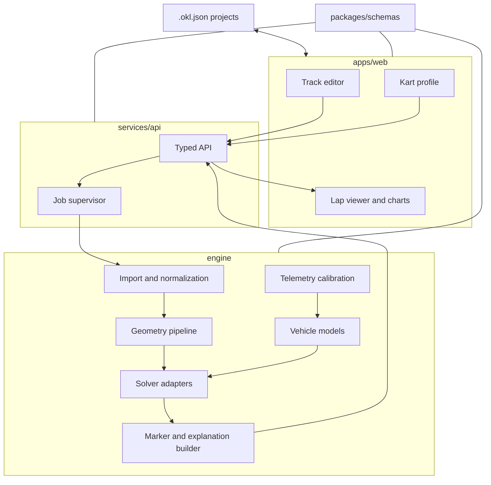

# Architecture

## Goals

- Keep physics usable from a CLI, notebook, test, API, or future desktop shell.
- Keep UI pixels and framework state out of scientific code.
- Make solver choice replaceable.
- Make every result reproducible and diagnosable.
- Work locally without authentication or network access after installation.

## Logical components



## Dependency rule

Dependencies point inward:

1. Domain schemas and pure math have no web dependency.
2. Solver adapters depend on domain interfaces, not UI or HTTP.
3. The API translates requests into engine commands.
4. The UI consumes versioned schemas and never imports Python implementation details.

## Coordinate and unit conventions

- Engine length: meters.
- Time: seconds.
- Speed: meters per second.
- Angles: radians.
- Power: watts.
- Mass: kilograms.
- Local track frame: right-handed Cartesian `(x, y)`.
- Curvilinear coordinate `s`: meters from the start line in driving direction.
- Boundary orientation and normal-vector convention will be locked by fixtures in M0.

Imports keep their original coordinate reference metadata. Geographic coordinates are projected to a suitable local metric frame before smoothing or optimization. Canvas transforms never mutate the canonical metric geometry.

## Track geometry pipeline

1. Import raw points and provenance.
2. Calibrate/project into meters.
3. Normalize direction and closure.
4. Remove duplicates and diagnose gaps.
5. Fit periodic splines with user-controlled smoothing.
6. Resample by arc length.
7. derive center/reference line and signed widths.
8. Check self-intersections, crossing normals, minimum width, and start continuity.
9. Produce an immutable `TrackModel` consumed by solvers.

Raw points are preserved so a new smoothing algorithm does not destroy user input.

## Job lifecycle

```text
queued -> validating -> running -> succeeded
                              \-> failed
                 \------------> cancelled
```

A job records input hash, model and solver versions, settings, progress, timestamps, status, warnings, and diagnostics. The API process may restart without corrupting project data. Cloud-scale persistence is deferred.

## Solver interface

Each backend accepts a validated track, kart model, environmental assumptions, solver settings, and optional initial guess. It returns either:

- a successful, dimensioned lap solution;
- an infeasible result with constraint diagnostics;
- a numerical failure with iteration diagnostics; or
- cancellation/timeout.

Backends must not return partially valid arrays as a successful result.

## API outline

The exact OpenAPI schema lands in M0. Expected local endpoints are:

```text
POST   /v1/tracks/validate
POST   /v1/jobs
GET    /v1/jobs/{job_id}
DELETE /v1/jobs/{job_id}
GET    /v1/jobs/{job_id}/result
POST   /v1/telemetry/inspect
POST   /v1/calibrations
```

## Deployment modes

- **Developer:** Vite dev server + FastAPI + local worker.
- **Local release:** one launcher serves the built web app and starts the worker.
- **Container:** optional reproducible Docker image after the physics MVP.
- **Desktop:** optional Tauri shell after cross-platform sidecar builds are automated.
- **Hosted:** future stateless API plus a durable job queue and object storage.
