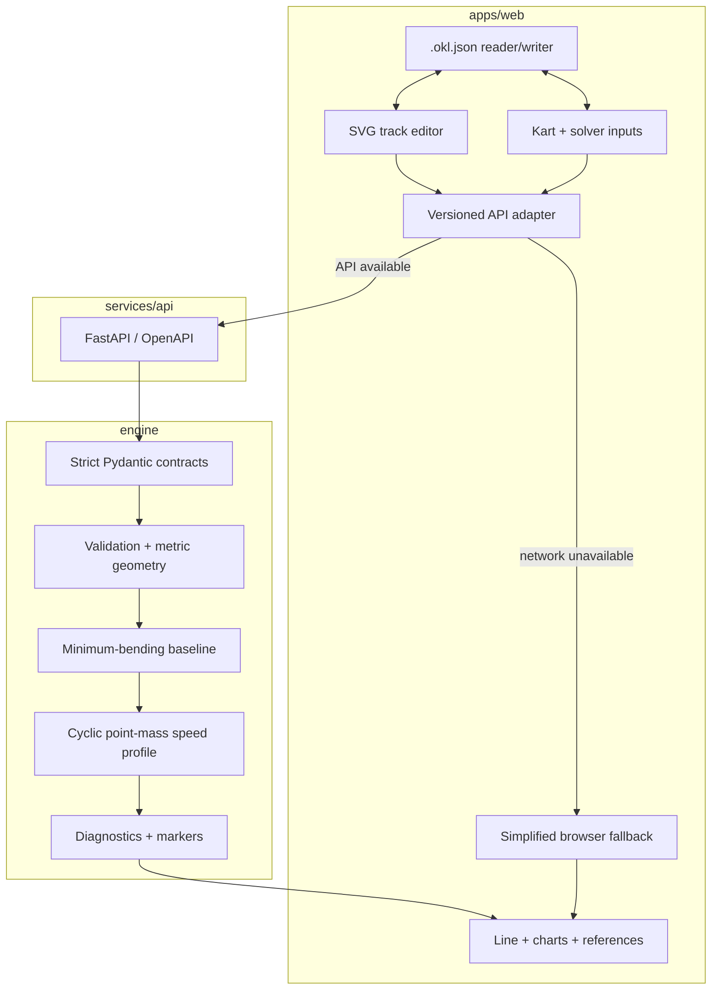

# Architecture

This document separates the architecture that runs today from the components planned for heavier solvers. That distinction is intentional: an alpha should be easy to reproduce without pretending that future infrastructure already exists.

## Design rules

- Scientific code is usable without React or HTTP.
- Canonical geometry uses meters; SVG pixels are only a view transform.
- Every public payload and project file has an explicit version.
- A failed or rejected solve never becomes a successful-looking scientific result.
- Identical valid inputs and settings produce equivalent outputs.
- The application remains useful locally without accounts, a database, or telemetry upload.

## Runnable alpha



The Vite development server proxies `/api` to a loopback-only FastAPI service. The endpoint runs a bounded synchronous MVP calculation. The static GitHub Pages demo cannot host Python, so it explicitly uses the less rigorous browser fallback.

### Current HTTP contract

```text
GET  /health
POST /v1/tracks/validate
POST /v1/simulations
GET  /docs
GET  /openapi.json
```

`POST /v1/simulations` accepts explicit left/right boundaries, kart parameters, and solver settings. A syntactically valid request returns one structured state: `success`, `invalid_input`, or `numerical_failure`. Validation and scientific failures are returned to the UI; only transport unavailability permits browser fallback.

### Dependency direction

1. `engine/openkartline_engine` depends on Pydantic and NumPy, never FastAPI or React.
2. `services/api` translates HTTP requests to engine calls.
3. `apps/web` owns presentation and maps its centerline/width editor model to explicit boundaries.
4. `.okl.json` is a local user-project format; API request/result schemas are separate contracts.

## Coordinate and unit conventions

- Length: meters.
- Time: seconds.
- Speed: meters per second inside the engine; km/h only for display/input fields that say so.
- Angles: radians.
- Mass: kilograms.
- Local frame: right-handed Cartesian `(x, y)`.
- Distance `s`: meters from the start sample in driving direction.
- Boundaries: `left_boundary` and `right_boundary` as seen while travelling in the declared direction.

The API accepts `power_hp` because it is familiar in karting and converts it immediately to mechanical watts. Raw project centerline coordinates remain metric and are independent of viewport size.

## Current calculation pipeline

1. Validate size, finite numeric range, closure, self-intersections, nesting, side semantics, and usable width.
2. Normalize direction and align the two boundaries.
3. Produce a periodic smooth representation and resample it by arc length.
4. Search for a corridor-constrained, deterministic minimum-bending baseline.
5. Derive station, heading, signed curvature, and segment lengths.
6. Apply lateral speed limits and cyclic forward-acceleration/backward-braking passes under a combined friction envelope.
7. Return samples, assumptions, warnings, solver/path diagnostics, and reproducible driving references.

The path is a local baseline, not proof of global minimum curvature and not a joint minimum-time solution.

## Failure boundaries

- HTML limits improve input ergonomics but domain validation remains authoritative.
- Project imports have byte, point-count, numeric-range, and schema-version limits.
- API request collections and solver iterations are bounded.
- Domain rejection is shown to the user and is never silently replaced by fallback output.
- Numeric arrays are returned only for a successful state.
- Localhost CORS is explicit and credentials are disabled.

## Planned long-running solver architecture

Joint path/control optimization may take seconds or minutes and must not run inside FastAPI background tasks. When that backend lands, an ADR must introduce a supervised process and a lifecycle such as:

```text
queued -> validating -> running -> succeeded
                              \-> failed
                 \------------> cancelled
```

That future API would add job submission, progress, timeout, cancellation, restart recovery, and immutable input/result hashes. None of those endpoints are claimed by the current alpha.

## Deployment modes

- **Static demo:** GitHub Pages plus browser fallback; no Python engine.
- **Developer/local:** Vite plus loopback FastAPI; current complete alpha workflow.
- **Future local release:** one launcher serving the built UI and supervised solver process.
- **Future container/desktop:** evaluated only after the physics MVP and cross-platform packaging tests.
- **Future hosted service:** requires authentication, quotas, durable jobs, privacy review, and abuse controls.
